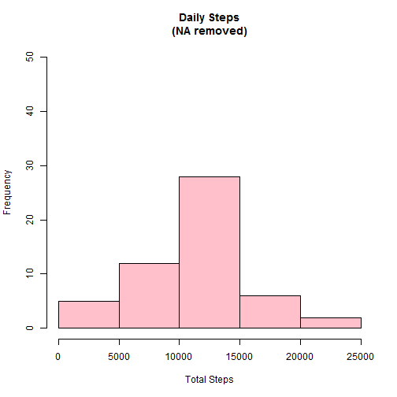
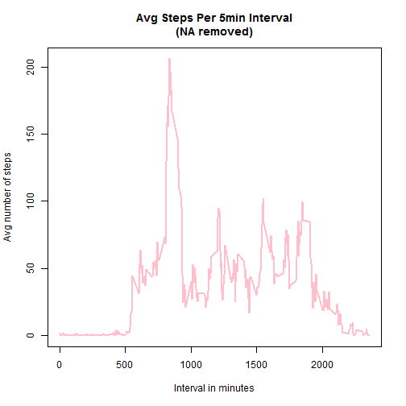
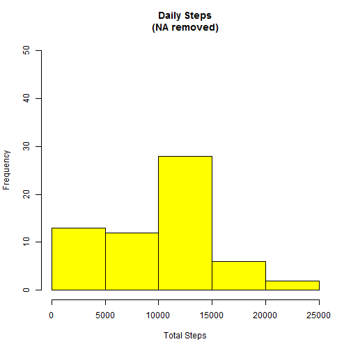

##Loading and preprocessing the data
###Load the Data

```r
setwd("~/")
library(knitr)
library(dplyr)
```

```
## 
## Attaching package: 'dplyr'
## 
## The following object is masked from 'package:stats':
## 
##     filter
## 
## The following objects are masked from 'package:base':
## 
##     intersect, setdiff, setequal, union
```

```r
activity_rawdata <- read.csv("activity.csv", stringsAsFactors=FALSE)
```

###Process/transform the data

Add date field to a useable format

```r
activity_rawdata$newdate <- strptime(as.character(activity_rawdata$date), "%Y-%m-%d")
activity_rawdata$date <- NULL
```

Add a new field to show the day of the week

```r
activity_rawdata$day <- weekdays(as.Date(activity_rawdata$newdate))
```

Organize all the new columns

```r
activity <- data.frame(date=activity_rawdata$newdate, 
                       weekday=activity_rawdata$day, 
                       interval=activity_rawdata$interval,
                       steps=activity_rawdata$steps)
```

##What is mean total number of steps taken per day?
###Calculate the total number of steps taken per day

```r
daily_sum<-activity %>% group_by(date) %>% summarize(total_steps=sum(steps))
daily_sum3 <- c(daily_sum[complete.cases(daily_sum[2]),])
```

###Make a histogram of the total number of steps taken each day

```r
hist(daily_sum3$total_steps, 
     breaks=seq(from=0, to=25000, by=5000),
     col="Pink", 
     xlab="Total Steps", 
     ylim=c(0, 50), 
     main="Daily Steps\n(NA removed)")
```

 

###Calculate and report the mean and median of the total number of steps taken per day

```r
mean(daily_sum2$total_steps)
```

```
## Error in mean(daily_sum2$total_steps): object 'daily_sum2' not found
```

```r
median(daily_sum2$total_steps)
```

```
## Error in median(daily_sum2$total_steps): object 'daily_sum2' not found
```

##What is the average daily activity pattern?
###Make a time series plot (i.e. type = "l") of the 5-minute interval (x-axis) and the average number of steps taken, averaged across all days (y-axis)

```r
#Find the mean for each interval inclusive of all dates
mean_data <- aggregate(activity$steps, 
                       by=list(activity$interval), 
                       FUN=mean, 
                       na.rm=TRUE)
#Rename columns
names(mean_data) <- c("interval", "mean")
#Create Time series Plot
plot(mean_data$interval, 
     mean_data$mean, 
     type="l", 
     col="pink", 
     lwd=2, 
     xlab="Interval in minutes", 
     ylab="Avg number of steps", 
     main="Avg Steps Per 5min Interval\n(NA removed)")
```

 

###Which 5-minute interval, on average across all the days in the dataset, contains the maximum number of steps?

```r
max_mean <- which(mean_data$mean == max(mean_data$mean))
max_interval <- mean_data[max_mean, 1]
```

##Imputing missing values
###Calculate and report the total number of missing values in the dataset (i.e. the total number of rows with NAs)

```r
NA_total <- sum(is.na(activity$steps))
```

###Devise a strategy for filling in all of the missing values in the dataset. The strategy does not need to be sophisticated. For example, you could use the mean/median for that day, or the mean for that 5-minute interval, etc.

```r
#Replace all NA's with 0
activity[is.na(activity)] <- 0
```

###Create a new dataset that is equal to the original dataset but with the missing data filled in.

```r
activity[is.na(activity)] <- 0
```

###Make a histogram of the total number of steps taken each day and Calculate and report the mean and median total number of steps taken per day. Do these values differ from the estimates from the first part of the assignment? What is the impact of imputing missing data on the estimates of the total daily number of steps?

```r
daily_sum<-activity %>% group_by(date) %>% summarize(total_steps=sum(steps))
daily_sum2 <- c(daily_sum[complete.cases(daily_sum[2]),])
hist(daily_sum2$total_steps, 
     breaks=seq(from=0, to=25000, by=5000),
     col="Yellow", 
     xlab="Total Steps", 
     ylim=c(0, 50), 
     main="Daily Steps\n(NA removed)")
```

 

```r
echo = FALSE
mean(daily_sum2$total_steps)
```

```
## [1] 9354.23
```

```r
median(daily_sum2$total_steps)
```

```
## [1] 10395
```

```r
#Yes the mean and median are different then what they were previously
```

##Are there differences in activity patterns between weekdays and weekends?
###Create a new factor variable in the dataset with two levels - "weekday" and "weekend" indicating whether a given date is a weekday or weekend day.

```r
activity$weekdayType <- ifelse(weekdays(activity$date) %in% c("Satuday", "Sunday"), 
    "weekend", "weekday")
```

###Make a panel plot containing a time series plot (i.e. type = "l") of the 5-minute interval (x-axis) and the average number of steps taken, averaged across all weekday days or weekend days (y-axis). See the README file in the GitHub repository to see an example of what this plot should look like using simulated data.

```r
library(lattice)
day_mean <-activity %>% group_by(weekday) %>% summarize(mean_steps=mean(steps))
day_mean$weekdayType <- ifelse(weekdays(day_mean$weekday) %in% c("Saturday", "Sunday"), "weekend", "weekday")
```

```
## Error in UseMethod("weekdays"): no applicable method for 'weekdays' applied to an object of class "factor"
```

```r
xyplot(mean ~ interval | weekdayType, day_mean, 
       type="l", 
       lwd=1, 
       xlab="Interval", 
       ylab="Number of steps", 
       layout=c(1,2))
```

```
## Error in eval(expr, envir, enclos): object 'weekdayType' not found
```
